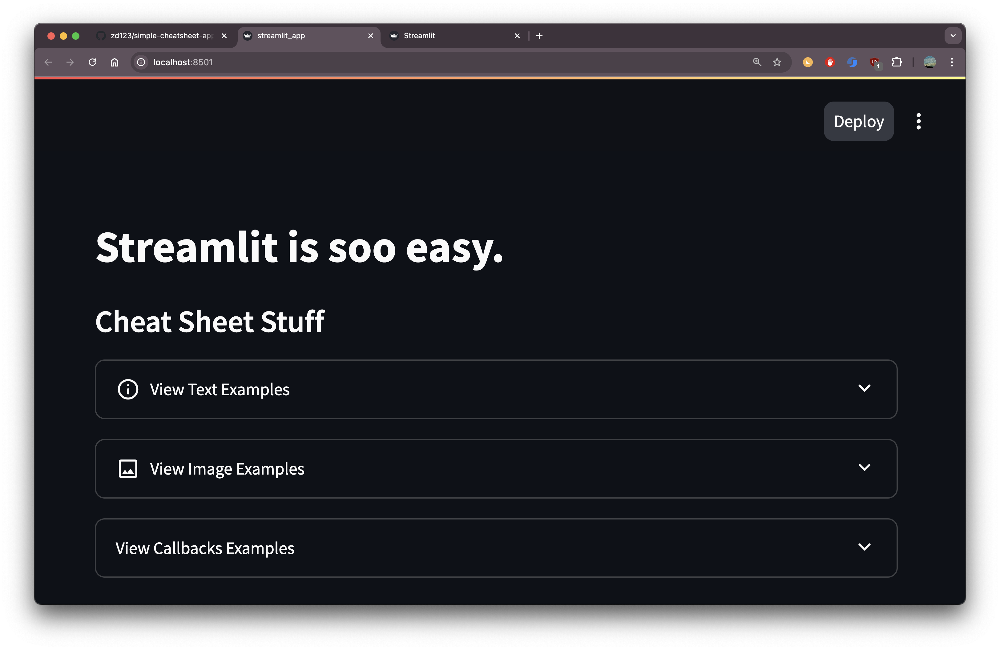
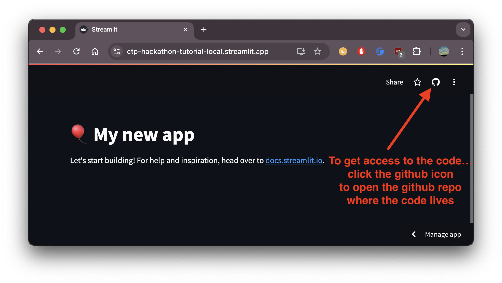
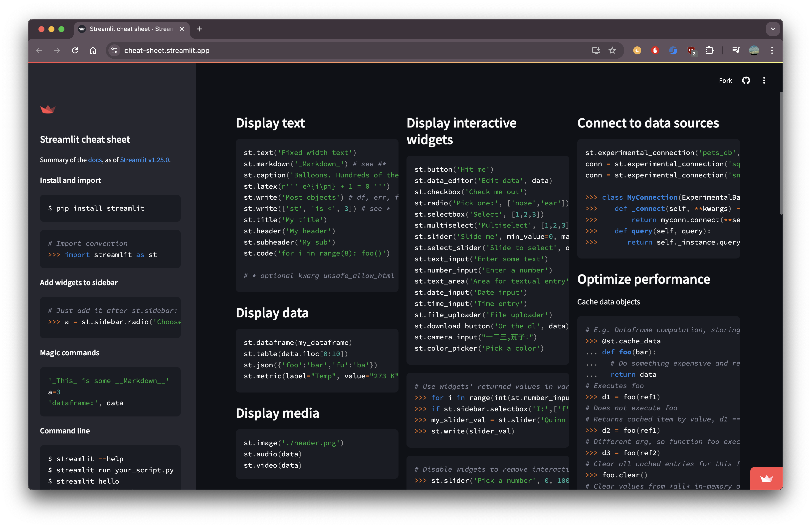

# Web Apps in 5 mins

We built this in 5 mins
[https://simple-cheatsheet.streamlit.app/](https://simple-cheatsheet.streamlit.app/)

### First Steps
0. Create a free [Streamlit account](https://share.streamlit.io/signup)
0. Install Streamlit `pip install streamlit`.

### Two Ways to do this


#### 1. Locally via a git Repo 
0. Create a new repo, and clone it to your local machine. 
0. Create a `README.md and streamlit_app.py and a requirements.txt` file in that repo. 
0. Develop your app in the streamlit_app.py
0. Add your requirements to the requirements.txt 
0. Add any instructions to the readme. 
0. Push your changes back to github. 
0. Run the app locally using `streamlit run streamlit_app.py`
0. That will open the app locally, and you will see a deploy button in the top right.  Click and follow the instructions.
  

#### 2. Online Via Streamlit Website
0. Click create app (top right corner).
0. Follow the prompts of linking your github, and then choose a template or a blank app. 
0. Change the domain and name of your app to whatever you want/is available. 
0. OPTIONAL: If you want to develop / code it in the cloud, Check the 'open github spaces' box, 0. Click Deploy.

* [my github code spaces link](https://bookish-broccoli-77q6pw763467.github.dev/)

-- Im going to do it local as well because im using cellphone for data. 

## Developing Locally 
0. First you need to get the files on your local machine... To do that open github by clicking the github icon (see image below). That will open the repo that was automatically created.  Then clone that repo locally. 
.
0. You should now see all the files in your local machine. 

### How to run / develop streamlit on your own machine
I would first just do `pip install streamlit`, however, you can also run the requirements. 

1. Install the requirements

   ```
   $ pip install -r requirements.txt
   ```

2. Run the app

   ```
   $ streamlit run streamlit_app.py
   ```
To run any streamlit app, you just type in `streamlit run <name_of_app_file.py>`. Above we are running the streamlit app that is coded in the `streamlit_app.py` file.  

### Editing your app
0. Open the `streamlit_app.py` file in your favorite IDE text editor.
0. Open the webpage of the [streamlit cheat sheet](https://cheat-sheet.streamlit.app/)


### Create a simple bio page. 
0. Create a new python file named `bio.py`. 
0. Open it and first, at the top include `import streamlit as st`. 
0. Add your name via any of the text methods listed in the cheat sheet. (My favorite is `st.markdown("# Hi, I'm Zack")`).  
0.0 Streamlit markdown uses Github Flavored Markdown. Here is a [cheat sheet for github flavored markdown formatting](https://github.com/adam-p/markdown-here/wiki/Markdown-Cheatsheet)


### [Streamlit Cheat Sheet](https://cheat-sheet.streamlit.app/)
### [Streamlit Docs](https://docs.streamlit.io/)
### [Streamlit App Gallery](https://streamlit.io/gallery)

### Add ons
https://streamlit.io/components